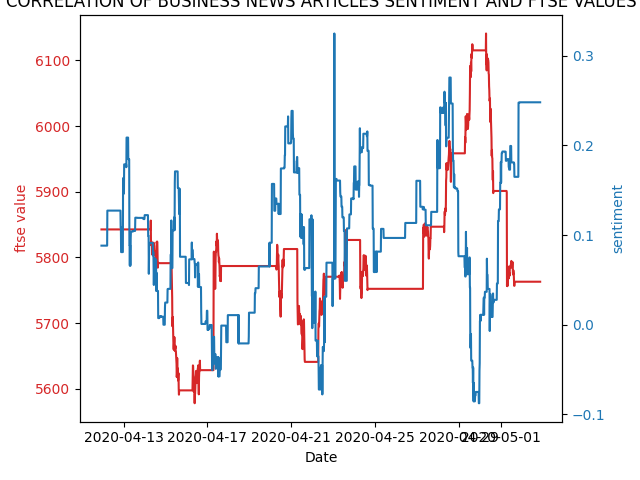
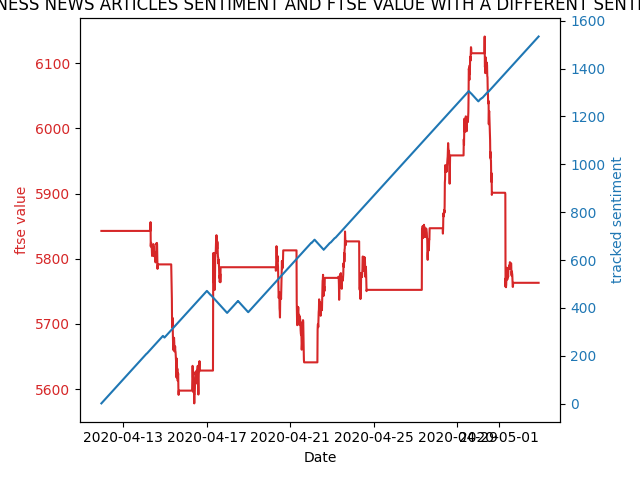

# Predicting the Effects of Business News Sentiments on Stock Market Behaviors

Plot the correlation between the sentiment of BBC Business News and FTSE stock market values.


# Introduction
The stock market is driven by fear and greed, but what information causes this? People, automatic trading systems, trading on the stockmarket gather and process multiple sources of information to make decisions of whether to buy or sell shares. This project is a study of if a correllation exists between a major business news provider in the UK, the BBC, and a major share value indicator, the FTSE 100.

With this project, on a 15 minute interval, the FTSE 100 value and the corresponding business news stories present on the BBC news website are gathered. A simple semantic analysis is undertaken of the news stories using the vader semantic analysis tool. Finally two graphical views are presented of semantic analysis against the FSTE values over a 4 week period to acertain if there can be any correlation of the values obtained.


# Usage

## Install Mysql

### For Mac

https://dev.mysql.com/doc/refman/5.7/en/osx-installation-pkg.html

Please make your mysql root password to be "nurdan" to allow our scripts to run.

### For Linux 

Please see my notes sections about install MySQL with docker below.

[Setting up Mysql](#Setting-up-Mysql)

## Data import

Inside the code directory run the following commands to download the gathered data from the 
https://gitlab.uzh.ch/nurdan.ay/sentiment_analysis_data

repository. Please note the data is 6.5 Gb in size, so please allow time for this to download. 
```
cd setup
./fetchData.sh
```

To import the data, ensure MySQL server is running on your machine (if using docker, please execute "run.sh" in the docker directory).

```
cd setup
./ReloadDB.sh
```

Please wait for a few minutes until the script completes after importing the data.

## Running the scripts
Make sure to install following dependencies:
```
pip3 install beautifulsoup4
pip3 install vaderSentiment
pip3 install peewee
```

Two types of functionality are available in the cli from the prepared code.

The CLI is provided from the main.py file. Full command line help is available from this file but I will explain the basic functionality of the command arguments here.

```
python3 main.py --data
```
The first argument here is to collect and analyse the data. This command has been run every 15 minutes over a 3 week period to collect the data provided in the "sentiment_analysis_data" repository. If you wish to see how the data collection works, you can run this command. We will not include any new data after the first 3 weeks of data in our output plots.

```
python3 main.py --graphs
```
This command shows a couple of different.  plots of sentiment data vs FTSE value. For detail of these plots see below


# Data

Two types of data has been gathered for 3 weeks as follows:

- **News data:** The data of business news articles has been taken from BBC business page in every 15 minutes:
https://www.bbc.com/news/business

 The business articles are not only from the business home page but also the sub business news. 


- **Stock indices:** Stock market index values has been taken from FTSE 100 which is a share index of
the 100 companies listed on the London Stock Exchange. This data has been fetched from Yahoo
Finance website automatically in every 15 minutes:
https://uk.finance.yahoo.com/

The data has been stored in a MySQL table.

Note: There is a UK bank-holiday on Monday April 13th right at the start of the dataset. 

## MySQL Table

Because I had problems with local install of MySql, MySQL runs in a Docker.

## Tables in MySQL

**FTSE table columns**

- id (primary key)
- date/time
- ftse value

**Stories table**

- id(primary key)
- date /time
- URL  <- stored so we will not have any duplicated story in the database
- html <- stored so we can reprocess the data if there is a problem with our text extraction
- text_content
- sentiment_score

**Link_table** <- The reason for this is not to download the story every time because they don't change too often.

- ftse_id
- stories_id
- cumulative sentiment score


*Example Run*

Get FTSE value = 4563 stored in the FTSE table with id=5 

Look at the BBC news website and find one new story
https://www.bbc.com/news/business-51874029
and 3 existing stories with IDs 6 7 8

Store the new story in Stories table, it gets an ID 9
https://gitlab.uzh.ch/nurdan.ay/sentimentanalysis
The link table will get 4 new rows:

| FTSE_id | stories_id  
| :-------| :----------:
|  5      | 6   
|  5      | 7 
|  5      | 8 
|  5      | 9 


When crawling the data, time library has been used to make the crawling sleep for 10 seconds. The reason to do this was to avoid to be blocked by BBC news. In some blogs, some people has mentined about this. When submitting , sleeping time has been changed to 0.5 seconds to make running and having the result fast.

The database has been created manually and peewee library created all the code of database automatically (please see db.py) . 

When extracting stories from BBC business news, 5 types of pages were found. Based on the type of the page, different html elements were detected for getting the context. 

'Cron' which is a time-based job scheduling daemon found in Unix-like operating systems has been used to run crawler every 15 minutes automatically.

0,15,30,45 * * * * /usr/bin/python3 /home/nurdan/sentimentanalysis/sentiment_analysis/crawler/main.py >> /home/nurdan/sentiment.log


# Results
The thought is that the sentiment will affect the market after a certain time. So, a shift is expected in the plots. 

1. Plot:  

There is not an obvious or consistent correlation between business news sentiment and stock market values here. We see some dates where short correlated times occur, for instance; between 2020-04-25 and 2020-04-29, it looks like by increasing or decreasing in sentiment correlates with the shifted increasing and decresing in ftse market. 


2. Plot: 

In this plot, another method is used to plot the sentiment. According to this model, the sentiment starts with the value of zero and increases by 1 if the sentiment is positive and decreases by 1 if the sentiment is a negative value. Unfortunately, an useful information cannot obtained from this plot.

## Probable Reasons
The reasons of not being able to find an obvious correlation might be:
- Not enough data <- The data has been obtained for 3 weeks which is not enough to do concrete anlaysis.
- Not enough data source <- The data has been obtained from only one source which is probbaly not the only information source for traders. Obtaining data from different sources such as other news websites, Reddit or specific traders chat pages might lead to better results. 
- Sentiment Analyser <- In this study, Vader sentiment analyser from NLTK has been used. This sentiment anlayzer is specified for social media sentiment rather than the financial usage. This led to some incorrect sentiment scores in this study. For example take a look at this story:

https://www.bbc.com/news/business-52200386

This is ID 48 in my stories table. Clearly this story is rather negative and yet Vader gave this story a content_sentiment of 0.9016 which is heavily positive.Unfortunately my dataset has lots of occurances of this kind of error, which means that we were unable to accurately calculate the sentiment.

The Vader is a rule-based analyser which consists dictionaries with words and their polarity values.  It does not have the recent words such as  "Coronavirus", "Covid19" which would add more negative sentiment for the articles. That's why, the sentiment scores obtained in this study might not be completely correct in terms of sentiment scores. In further studies, the dictionaries in Vader can be updated with more finance-related words or another sentiment analyser can be used.

## All code development is in 'https://gitlab.uzh.ch/nurdan.ay/sentimentanalysis'

# Data Sources and References

http://docs.peewee-orm.com/en/latest/
https://www.bbc.com/news/business
https://finance.yahoo.com/quote/%5EFTSE?p 
https://pypi.org/project/vaderSentiment/

https://www.digitalocean.com/community/tutorials/how-to-use-cron-to-automate-tasks-ubuntu-1804

https://www.learndatasci.com/tutorials/sentiment-analysis-reddit-headlines-pythons-nltk/

https://github.com/vl21/sentiment-analysis-on-news-headlines-descriptions/blob/master/EDA%20Sentiment%20Analysis%20on%20News%20Headlines%2C%20Descriptions%20of%20Most%20Liquid%20Stocks%20.ipynb


Soonh Taj, Baby Bakhtawer Shaikh, Areej Fatemah Meghji (2019) 'Sentiment Analysis of News
Articles: A Lexicon based Approach', 2nd International Conference on Computing Mathematics &
Engineering Technologies-2019 (iCoMET), (978-1-5386-9509-8), pp. .

Dev Shah , Haruna Isah , Farhana Zulkernine (2018) 'Predicting the Effects of News Sentiments on
the Stock Market ', https://arxiv.org/, (1812.04199), pp. 4.


# My notes

In the sections below you can find the notes I made during the development of this project. They are left here for reference only.


# Setting up Mysql


## Local install

Had problems with local install.

Problems where, mysql is installed as a service on my laptop which runs all the time. I did not want this to happen. I found a nice page about using a docker install which avoided this problem. The details are here:

https://www.dabbleofdevops.com/blog/setup-a-mysql-python-docker-dev-stack


## install mysql with docker on Ubuntu

See docker folder for basic configuration.

We need to install docker and docker-compose like this

### install docker

NOTE: These instructions are for Ubuntu 18.04 which I am using on my laptop

Reference https://www.digitalocean.com/community/tutorials/how-to-install-docker-compose-on-ubuntu-18-04

run these commands

```
sudo apt update

sudo apt install apt-transport-https ca-certificates curl software-properties-common

curl -fsSL https://download.docker.com/linux/ubuntu/gpg | sudo apt-key add -

sudo add-apt-repository "deb [arch=amd64] https://download.docker.com/linux/ubuntu bionic stable"

sudo apt install docker-ce

```

Installation should be complete now. Run the following command to check that docker is working

```
sudo systemctl status docker
```

Now we need to allow docker to run as a normal user:

```
sudo usermod -aG docker ${USER}
```

To apply the new group membership, log out of the server and back in, or type the following:

```
su - ${USER}
```

### install docker compose

For reference see this:
https://www.digitalocean.com/community/tutorials/how-to-install-docker-compose-on-ubuntu-18-04

```
sudo curl -L https://github.com/docker/compose/releases/download/1.21.2/docker-compose-`uname -s`-`uname -m` -o /usr/local/bin/docker-compose
```

Set permissions

```
sudo chmod +x /usr/local/bin/docker-compose
```

Verify install like this:

```
docker-compose --version
```
You should see something like this:
```
docker-compose version 1.21.2, build a133471
```

### Setting up initial DB

In my project folder CD to docker directory


```
cd docker
```
Check there is a data directory in this folder, if there isn't make one with :
```
mkdir data
```

run the configuration for our DB (has my passwords setup in it)

```
./run.sh
```
pip3 install mysql-connector
pip3 install peewee
pip3 install beautifulsoup4

## DBeaver
I installed it to my local computer and connect it to mySQL via entering the password. " It asked me if I want to create a sample database. I said yes. 


# generate peewee Data Access Objects (DAO) automatically with:

python -m pwiz -u root -P -e mysql sentimentanalysis > db.py

## For remote server laptop

python -m pwiz -u root -P -H 192.168.0.3 -e mysql sentimentanalysis > db.py


